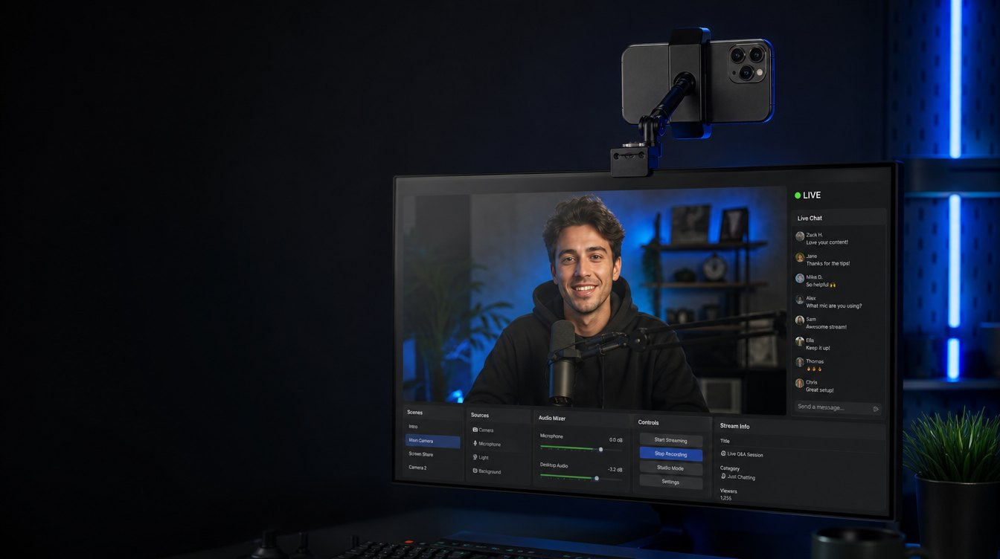
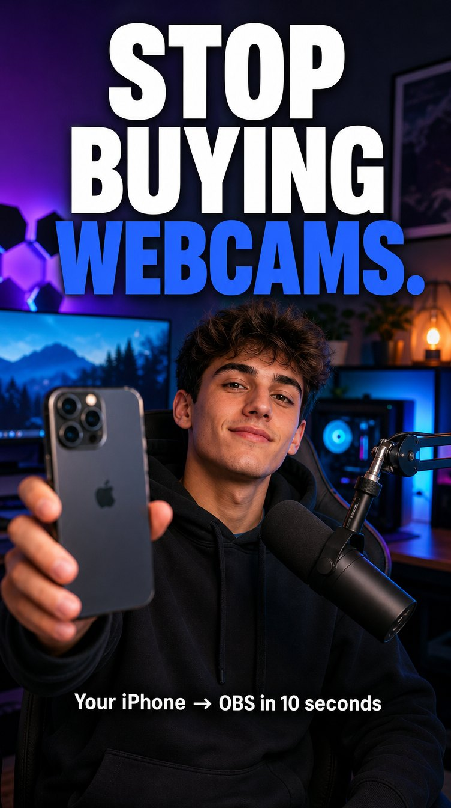
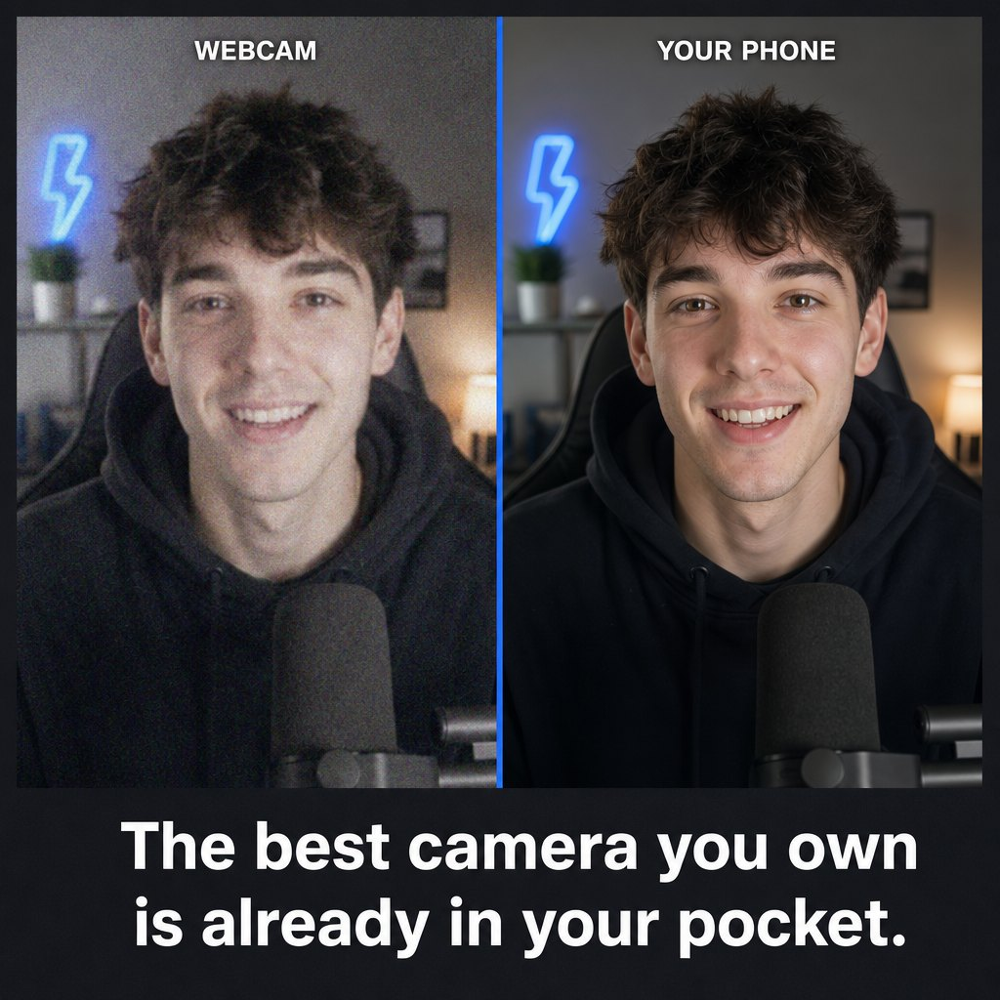
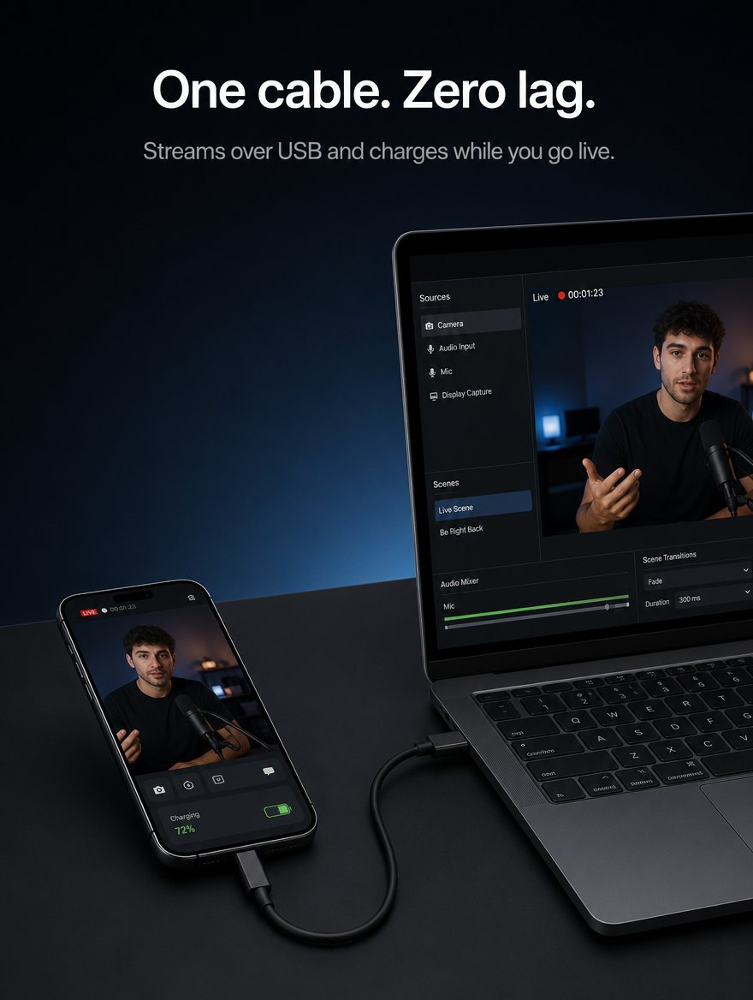
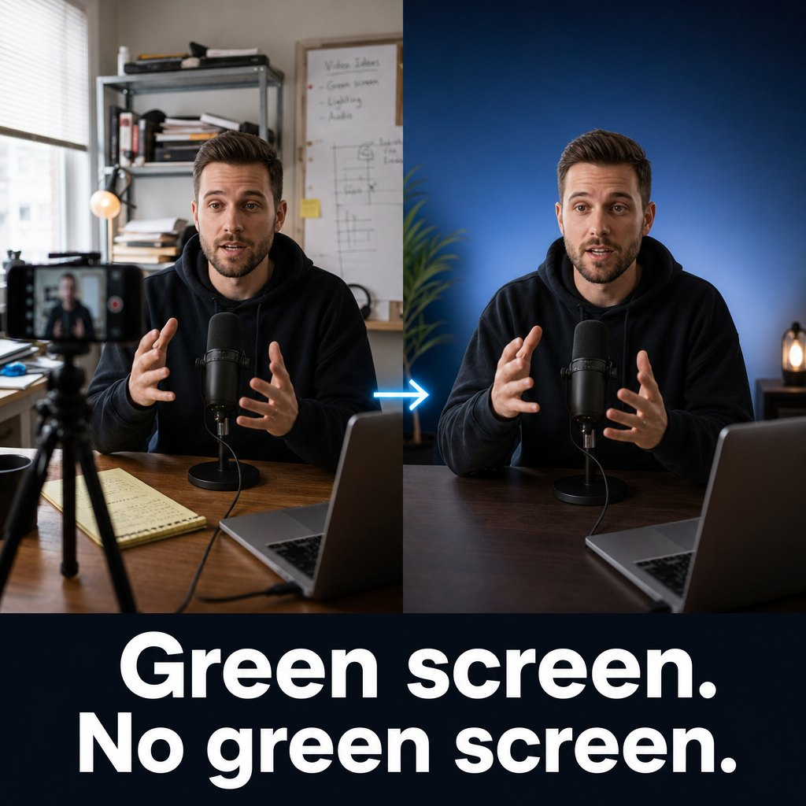
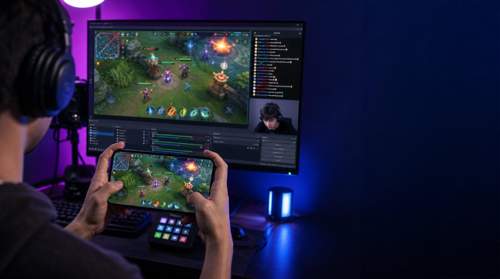

# LensLink campaign: "Already in your pocket"

A launch-and-grow plan for LensLink (the free LensLink Camera app plus the
open-source OBS plugin). It covers positioning, audiences, the creative set,
channels, a 12-week calendar, the budget and how to measure it.

**Budget: under $300 for the whole 12 weeks.** The plan is organic first;
money only amplifies what has already worked for free (section 7).

Creative drafts live in [`creative/`](creative/). They were generated with
Higgsfield (GPT Image 2) and are concept art. See "Before anything ships"
at the end for what to fix before a paid placement.

## 1. The one idea

**The best camera you own is already in your pocket. LensLink puts it
straight into OBS.**

Every campaign asset returns to this. People already paid for an excellent
camera; they just can't get it into their stream cleanly. LensLink is the
missing cable, and it's free.

### Positioning statement

For streamers, creators and anyone running OBS Studio who wants a better
picture than a webcam, LensLink turns an iPhone or iPad into a native OBS
source over Wi-Fi or USB. Unlike webcam-emulation apps, it plugs straight
into OBS with no virtual camera driver, no RTMP server, no account and no
subscription, and it gives you pro controls (4K60, HEVC, HDR, Apple Log,
lens switching) from the phone, the browser or OBS itself.

### Messaging pillars

| Pillar | Claim | Proof in the product |
|---|---|---|
| **Picture** | Your phone beats your webcam. | Up to 4K60, H.264 or HEVC, 10-bit HLG, Apple Log on Pro iPhones, every lens switchable live |
| **Native to OBS** | It's an OBS source, not a fake webcam. | "LensLink Camera" and "LensLink Screen" sources, status-bar health readout, LensLink dock |
| **Free, for real** | No subscription, no watermark, no account. | Free on the App Store, GPL plugin, no analytics, video never leaves your network |
| **Set and forget** | Mount it once, never touch it again. | Remote start from OBS, Siri and Shortcuts, USB charging while live, auto lip-sync |
| **Grows with you** | One phone today, a multicam rig tomorrow. | One source per phone, USB device pinning, one web panel with a tab per camera, scriptable `/api/control` |

### Tagline bank

- Already in your pocket.
- Stop buying webcams.
- Your iPhone, live in OBS.
- One cable. Almost no lag. (Never "zero lag": latency is measured and shown, so it isn't zero.)
- Green screen. No green screen.
- Your phone is the camera crew.
- 4K60. $0. No subscription.

## 2. Audiences

Ranked by size and how quickly they convert.

1. **Budget streamers (Twitch, YouTube, Kick).** Own an iPhone, run OBS,
   stream with a $50 webcam or none. Hook: "Stop buying webcams." Where:
   TikTok, YouTube Shorts, r/Twitch, r/streaming, r/obs, streamer Discords.
2. **Mobile gamers.** Want to stream the phone's screen with game audio.
   Hook: screen mirroring into a dedicated LensLink Screen source, HEVC,
   Wi-Fi or USB. Where: TikTok gaming, r/MobileGaming, game-specific
   Discords, YouTube gaming Shorts.
3. **Windows and Linux OBS users.** Apple's Continuity Camera only serves
   Macs. Hook: "The iPhone webcam that works on Windows and Linux too."
   Where: r/linux, r/linux_gaming, r/Windows, Hacker News, OBS forums.
4. **Podcasters, educators, church and event AV.** Need two or three
   angles on a budget. Hook: multicam from phones people already have,
   controlled from one browser tab. Where: r/podcasting, r/churchtech,
   r/VideoEditing, LinkedIn, Facebook AV groups.
5. **Filmmakers and colourists.** Care about Apple Log and HDR. Hook:
   "Grade your live stream." Where: r/colorists, r/cinematography,
   YouTube gear channels.

## 3. Creative set

Six concepts, each with a hero asset in `creative/`. Copy is ready to
paste; headlines stay within Meta, TikTok and Reddit limits.

### A. Hero: "Your iPhone, live in OBS" (16:9)

- **Use:** website hero test, YouTube banner, Product Hunt gallery,
  landscape paid placements, press kit.
- **Headline:** Your iPhone, live in OBS.
- **Body:** Turn the phone you already own into a 4K camera for OBS
  Studio. Wi-Fi or USB. Free, no subscription.
- **CTA:** Get LensLink

### B. "Stop buying webcams" (9:16)

- **Use:** TikTok, Reels and Shorts cover, Story ads, Snapchat.
- **Headline:** Stop buying webcams.
- **Body:** Your iPhone is a better camera than anything under $200.
  LensLink puts it in OBS in seconds, for free.
- **CTA:** Download free
- **Fix before paid use:** the phone shows an Apple logo. Regenerate or
  retouch it out (see section 10).

### C. "Already in your pocket" comparison (1:1)

- **Use:** Instagram and Facebook feed, Reddit promoted posts, X, the
  App Store product page's first screenshot test.
- **Headline:** The best camera you own is already in your pocket.
- **Body:** Same room, same light. Left: a webcam. Right: an iPhone
  through LensLink. Free for iPhone and iPad, works with OBS on Windows,
  Mac and Linux.
- **CTA:** See the difference
- **Replace with a real capture** before paid use (section 10). A real
  side-by-side from the same desk is more convincing and is honest.

### D. "One cable" USB (3:4)

- **Use:** Instagram feed, Pinterest, Apple Search Ads custom product page
  art, Reddit.
- **Headline:** One cable. Almost no lag.
- **Body:** Plug in over USB and LensLink streams with the lowest latency
  and charges the phone while you're live. No network needed.
- **CTA:** Set it up in 2 minutes
- **Fix before use:** the baked-in headline says "Zero lag". Regenerate
  with "Almost no lag" or overlay the text in the editor.

### E. "Green screen. No green screen." (1:1)

- **Use:** feed ads for podcasters and educators, YouTube community post,
  LinkedIn.
- **Headline:** Green screen. No green screen.
- **Body:** LensLink cuts you out on the phone and hands OBS a clean key,
  filter included. On Face ID and LiDAR cameras it even ignores people
  walking behind you. (Beta.)
- **CTA:** Try the virtual green screen

### F. Mobile gaming: "Stream your phone's screen" (16:9)

- **Use:** TikTok and YouTube gaming, Discord partner posts, r/MobileGaming.
- **Headline:** Stream your phone games in OBS.
- **Body:** Mirror your iPhone or iPad screen with game audio into its own
  OBS source. Wi-Fi or USB, HEVC quality, free.
- **CTA:** Start mirroring

## 4. Video scripts

Record on real devices; the product is visual and the setup speed is the
selling point. Keep the stream-health readout
(`LensLink: iPhone 60 fps · 11.9 Mb/s · 43 ms`) on screen whenever
possible: real numbers beat adjectives.

### 15 s vertical: "Stop buying webcams"

| Time | Picture | Words (VO or caption) |
|---|---|---|
| 0-2 s | Creator tosses a boxed webcam off the desk | "Stop buying webcams." |
| 2-5 s | Clips iPhone to monitor, opens LensLink, taps Start Camera | "Your iPhone is already a better camera." |
| 5-9 s | OBS: Sources, +, LensLink Camera, picks phone from dropdown; picture appears | "LensLink puts it straight into OBS." |
| 9-13 s | Split screen webcam vs LensLink, pinch-to-zoom, lens switch | "4K. Every lens. Wi-Fi or USB." |
| 13-15 s | End card: logo, "Free on the App Store" | "Free. No subscription." |

### 30 s horizontal: YouTube pre-roll and Product Hunt video

1. **Hook (0-5 s).** Grainy webcam shot of the creator: "This is my
   webcam." Cut to crisp LensLink shot: "This is my phone."
2. **How (5-15 s).** Two-step setup in real time: install plugin, open app,
   add source. Timer on screen.
3. **Why (15-25 s).** Quick cuts: lens switch live, tap to focus from the
   browser panel, Siri "Start streaming with LensLink", USB cable charging,
   status-bar health readout.
4. **Close (25-30 s).** "LensLink. Your iPhone, live in OBS. Free."
   lenslink.cam.

### 60-90 s tutorial: "iPhone as a webcam in OBS (Windows, Mac, Linux)"

A plain screen-recorded walkthrough built for search, not for ads. Title it
exactly the way people search: "How to use your iPhone as a webcam in OBS
(free, 4K, no Camo)". Pin a comment with the download links. Reuse it as
the embedded video on lenslink.cam/setup.

### Short-form series ideas (one per week)

- "Things your webcam can't do": one feature per clip (Apple Log grade,
  telephoto lens switch, virtual green screen, remote start with Siri).
- "Setup under a minute" speed runs on Windows, Mac and Linux.
- "Rate my stream setup": creators send setups, you upgrade the camera
  with LensLink, before and after.
- "Old iPhone, new job": dig out a retired iPhone from a drawer and make
  it a second angle. Strong emotional hook and a reason to own several.

## 5. Channels

### Owned (free, start here)

- **App Store product page.** Run Product Page Optimization with three
  first-screenshot variants: the comparison (C), the hero (A) and a real OBS
  screenshot. Add an **In-App Event** for each notable release (for example
  "Virtual green screen beta") so the app shows up in event cards and
  search. Submit the app through Apple's "Promote your app" featuring
  nomination form ahead of each big release.
- **lenslink.cam.** Add comparison and intent pages that match searches:
  "iPhone webcam for OBS", "use iPhone as webcam on Windows", "iPhone
  webcam on Linux", "Camo alternative", "Continuity Camera for Windows",
  "stream iPhone screen to OBS". Each links to the App Store and the
  plugin download. Remember CLAUDE.md: new pages need `DOC_ORDER` and the
  i18n files if they live under `docs/`.
- **GitHub.** A demo GIF at the top of the README, topics (`obs`,
  `obs-plugin`, `webcam`, `iphone`, `streaming`), and PRs to "awesome OBS"
  lists. Release notes written for users, cross-posted to socials.
- **OBS forums.** List the plugin in the OBS Resources section with the
  hero image and a short video. Answer every thread.
- **In the app.** A single, dismissible "Enjoying LensLink? Rate it" prompt
  via `SKStoreReviewController` after the third successful stream. Ratings
  drive App Store ranking more than any ad.

### Community (free, highest trust)

- **Reddit.** Lead with value, not ads: a "I built a free, open-source way
  to use your iPhone as an OBS camera" post in r/obs, r/Twitch,
  r/streaming, r/iphone, r/linux and r/opensource, spaced across two
  weeks. Include the real comparison video. Reply to every comment for 48
  hours.
- **Hacker News.** "Show HN: LensLink, an open-source iPhone camera plugin
  for OBS". Lead with the engineering (zero-copy receive path, custom
  protocol, HEVC, GPU decode), link the repo, post Tuesday to Thursday,
  8 to 10 am US Eastern.
- **Product Hunt.** Launch on a Tuesday with assets A, C and the 30 s video.
  Line up 20 to 30 supporters in advance and reply to every comment on the
  day.
- **Discord.** Streamer-tools, OBS, and mobile-gaming servers; share
  tutorials in help channels when someone asks about webcams.

### Creators (low cost, biggest lever)

LensLink is free, so pitch creators on content value, not affiliate
revenue.

- **Micro creators (2k to 50k followers)** in streaming tips, stream setup,
  budget tech and mobile gaming. No cash fees: offer early TestFlight
  builds, a shout-out in release notes, and a co-hosted setup giveaway
  (section 7).
- **Tech and streaming explainers on YouTube** (OBS tutorial channels,
  "best webcam" reviewers). Pitch the story "free, open-source app beats a
  $150 webcam". Send a short press kit (section 8).
- **Brief for creators:** show real setup time, show the webcam comparison
  in the same light, mention "free, no subscription", link the App Store
  and lenslink.cam. They pick the tone.

### Paid (small, and only after organic proves the message)

- **Apple Search Ads ($150).** Highest intent, so it gets the first
  dollar. Exact match only, five keywords: "obs camera", "iphone webcam",
  "webcam for obs", "camo", "streaming camera". Skip broad terms like
  "webcam" that burn budget. Custom product page with asset C. Hard cap
  $5 a day for 30 days (weeks 3 to 6).
- **Reddit ads ($60).** One promoted post, the organic post that already
  did best, in r/obs, r/Twitch and r/streaming. $5 a day for 12 days
  (weeks 3 and 4).
- **Not in this budget:** TikTok Spark Ads (ad-group minimums of about
  $20 a day would use a third of the budget in a week), YouTube ads and
  creator fees. Boost organically instead: post natively on TikTok and
  Shorts and let the algorithm decide.

## 6. 12-week calendar

| Week | Focus | Key actions |
|---|---|---|
| -2 to -1 | **Prep** | Record the real comparison and the 15/30/90 s videos. Fix creative flags. Build the lenslink.cam intent pages. Set up tracking links. Line up Product Hunt supporters and 10 creators. |
| 1 | **Launch** | Product Hunt (Tue), Show HN (Wed), r/obs and r/opensource posts, 90 s tutorial live on YouTube, first 3 TikToks. |
| 2 | **Community push** | r/Twitch, r/streaming, r/iphone, r/linux posts spaced out. OBS forum listing. Creator videos start landing. |
| 3-4 | **Paid test** | Apple Search Ads on ($5/day cap). Reddit ad on the best organic post ($5/day, 12 days). App Store Product Page Optimization test live (free). |
| 5-6 | **Feature spotlight** | Virtual green screen push to podcasters and educators (asset E). In-App Event. LinkedIn and r/podcasting. |
| 7-8 | **Mobile gaming** | Screen mirroring push (asset F). Gaming Discord partners, TikTok gaming creators. Setup giveaway with one gaming creator. |
| 9-10 | **Pros** | Apple Log and HDR story: "Grade your live stream". Colourist and cinematography creators, r/colorists. |
| 11-12 | **Review** | Spend any reserve on the winner. Tally cost per install per channel. Plan the next release's campaign around the next roadmap feature. |

## 7. Budget: $290 of $300

| Line | Amount | How it's spent | When |
|---|---|---|---|
| Owned + community + organic video | $0 | Everything in sections 4 and 5 that isn't marked paid | All 12 weeks |
| Apple Search Ads | $150 | Exact match, 5 keywords, $5/day cap, 30 days | Weeks 3-6 |
| Reddit ads | $60 | One promoted post (the best organic one), $5/day, 12 days | Weeks 3-4 |
| Setup giveaway | $50 | Two phone clamp mounts (about $25 each) for a "Rate my stream setup" giveaway co-hosted with a creator, in place of a fee | Weeks 7-8 |
| Reserve | $30 | Goes to whichever paid line has the lowest cost per install; unspent if neither hits target | Weeks 11-12 |
| **Total** | **$290** | $10 of headroom under the $300 limit | |

Rules that keep it under $300:

- Set the daily caps and a lifetime budget in each ad platform, so the
  platform itself stops spending at the limit.
- Pause any paid line whose cost per install is above $2 after its first
  $30. Move what's left of it to the reserve.
- Nothing paid runs until week 3. The launch weeks tell you which message
  and asset to spend on.
- Creative costs nothing extra: the 4 Higgsfield credits left cover the two
  image fixes in section 10, and the videos are shot on your own phone.

## 8. Press kit

One page on lenslink.cam (`/press`) with:

- One-paragraph description and a 50-word version.
- The facts: free, open source (GPL-2.0-or-later), iOS 15+, OBS 32+,
  Windows, macOS and Linux, Wi-Fi or USB, up to 4K60, HEVC and H.264,
  HLG and Apple Log, no account, no analytics.
- Logo files (`assets/logo.png`, `assets/banner-*.png`), assets A to F, and
  real screenshots of OBS with the LensLink dock and status readout.
- The 30 s video and the tutorial.
- A contact email.

## 9. Measurement

The app has no analytics by design, so measure at the edges.

- **App Store Connect:** use campaign links (`?pt=...&ct=<campaign>`) on
  every post and ad, so App Analytics splits impressions, page views and
  downloads by source.
- **GitHub:** release asset download counts per platform (a proxy for
  plugin installs), stars, and traffic referrers.
- **lenslink.cam:** Cloudflare Web Analytics (cookie-free, fits the
  privacy promise) for page views and outbound clicks to the App Store.
- **Social:** views, saves, shares and comments per clip. Saves and
  shares predict installs better than likes.

### Targets for the 12 weeks

| Metric | Target |
|---|---|
| App Store downloads | 5,000 (about 150 of them paid) |
| App Store rating | 4.6 or higher with 100+ ratings |
| Plugin downloads (all platforms) | 4,000 |
| GitHub stars | +750 |
| Product Hunt | Top 5 of the day |
| Paid cost per install | under $1.50 (pause above $2) |
| Tutorial video views | 25,000 |

These are lower than a funded campaign would target. With $290, paid
brings in roughly 150 installs; the rest has to come from Reddit, Hacker
News, Product Hunt, creators and search.

## 10. Before anything ships

- **No Apple logo, no OBS logo.** Asset B shows an Apple logo on the phone.
  Retouch or regenerate before any paid use. "iPhone", "iPad" and "OBS
  Studio" are fine as plain words describing compatibility ("for OBS
  Studio", "works with iPhone"), never as part of the product name or in
  a logo lockup. App Store Connect already rejects "iPhone" in the
  subtitle.
- **No overclaims.** Replace "Zero lag" in asset D. Keep every claim in
  step with the README and `docs/APP_STORE.md` (for example HDR, Apple Log
  and virtual green screen are **beta**, and Apple Log needs a Pro iPhone
  on iOS 17+).
- **Honest comparisons.** The AI-generated webcam comparison (C) is a mock.
  For ads, shoot a real side-by-side in the same light and keep the raw
  files. Don't name competitors in paid ads; comparison pages on
  lenslink.cam may, if they stay factual and dated.
- **Real product in the video.** Ads that show the actual app and OBS
  convert better and pass App Store and platform review. Use the generated
  images as thumbnails and statics, not as proof of picture quality.
- **Translations.** The app and site ship in several languages
  (`docs/LOCALIZATION.md`). Once English performs, localise the top two
  assets using the glossary there, starting with the store's largest
  non-English markets.
